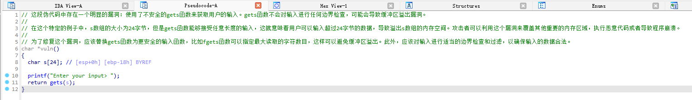

辅助分析ida伪代码：

api来源于[这个项目](https://github.com/chatanywhere/GPT_API_free)，也可以直接[点击这里](https://api.chatanywhere.org/v1/oauth/free/render)申请API key，替换掉源码中空出来的api key即可

2.28更新：

- 加入对deepseek-v3的支持
- 新增本地代理接口解决网络问题